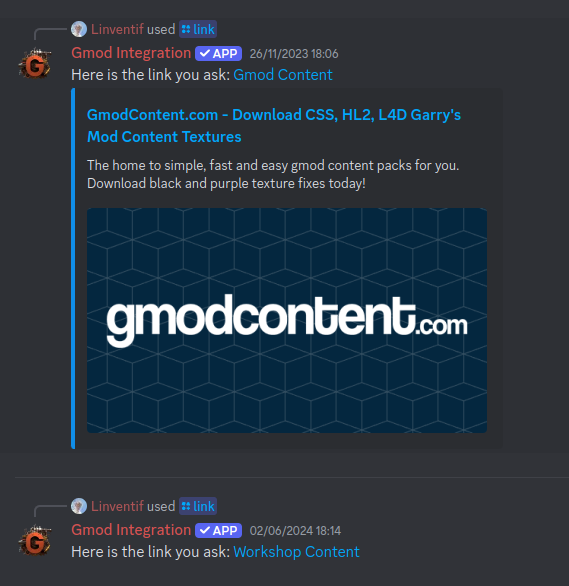
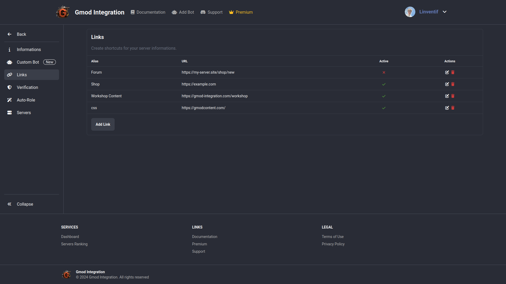

# Guild Links

Guild Links are like shortcuts to ressources, for example if someone ask for the server collection or CSS Content you don't have to search manualy the link, you can just `/link collection` or `/link css` and the bot will send the link.

## Example

## Configuration

You can create a new link with the command `/link create <name> <url>` and delete it with `/link delete <name>`

