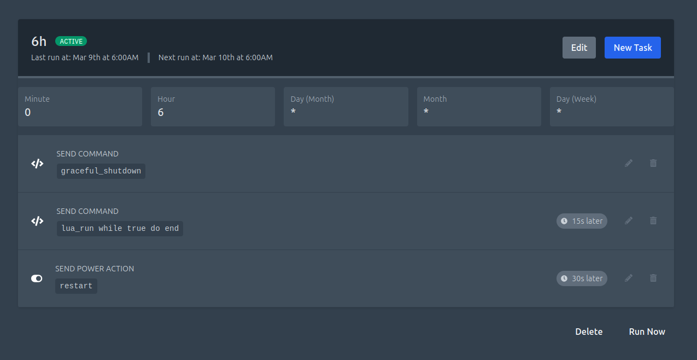
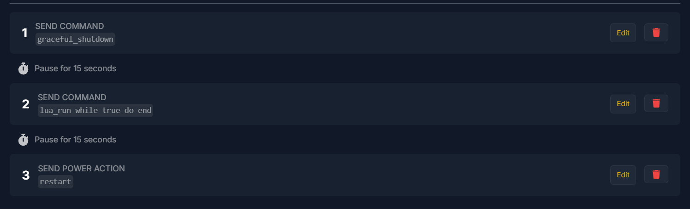

# If you are crashing your server before restart READ THIS

:::warning

If you are restarting your server daily and using an auto-reconnect addon for your clients, you might using a `while true do end` crasher to force clients to reconnect. While this method keeps clients connected during a restart, it is not recommended.

This approach prevents the server from properly shutting down all addons, potentially causing issues. For instance, many actions in Gmod Integration rely on the client disconnect event (such as saving player time, kills, rank, etc.). If the server crashes, this event will not be triggered.

To avoid these issues, use the following code to gracefully shut down your server before crashing it:

:::

Create a new file in your server's `lua/autorun/server` folder and name it `graceful_shutdown.lua`. Add the following code to the file:

```lua
-- Add this code server side
concommand.Add("graceful_shutdown", function(ply, cmd, args)
  // Only allow the server console to run this command
  if ply != NULL then return end
  hook.Run("ShutDown")
  print("Graceful shutdown executed you can now crash your server")
end)
```

Next go in your hosting panel and add a task to run the command `graceful_shutdown` before your `lua_run while true do end` task.

## Examples of tasks

### Pterodactyl



### Physgun Hosting


