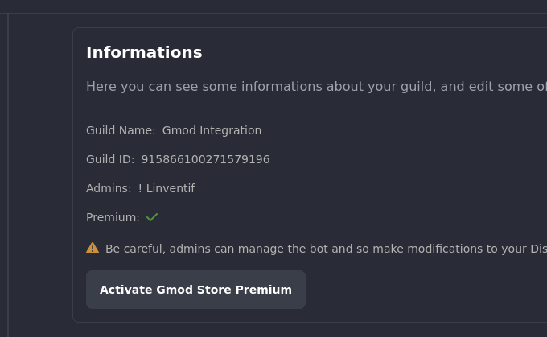

# Gmod Store Premium

Some features like 'Custom Bot' are only available for Gmod Store purchases. You can buy the premium version on the [Gmod Store](https://gmod-integration.com/gmodstore).

## How to activate the premium version ?

To activate the premium version, you need to follow these steps:

1. First verify that your steam account is linked to your discord account or do it on the [account](https://gmod-integration.com/account) than click on the `Link Steam` button (if not done yet).
2. Go on the [dashboard](https://gmod-integration.com/dashboard/guilds) and select a setup guild or follow the [guide](/getting-started/installation) to setup the discord bot and the gmod addon.
3. Click on the `Activate Gmod Store Premium` in the information section of the guild.
4. You should be redirected to the dashboard and see a crown icon in the guild card.

If you have any issue, you can contact us on our [discord](https://gmod-integration.com/discord).

## In how many guilds can I activate the premium version ?

You can activate the premium version in only one guild.
