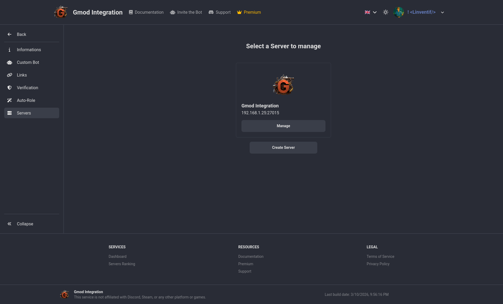
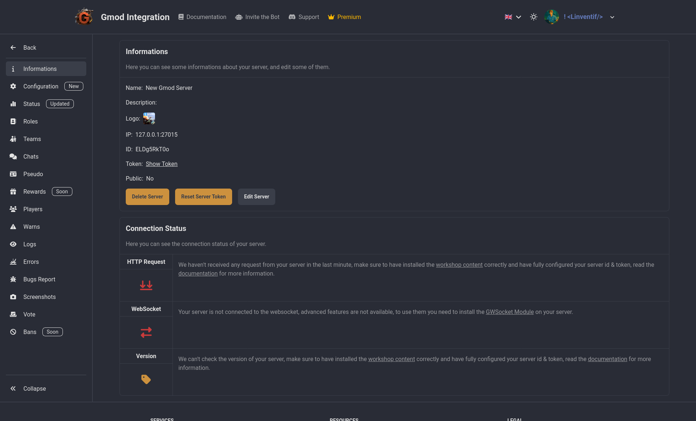

# Configuration

## Create Server

To connect you guild to you gmod server, you will need to create a new server for your guild by clicking the `Create Server` of the server list page.



## Get Server Token & ID

On the same page now click on server you just created, you will see the Information page with the server token and id, you will to click on the `Click to Show` button to show the token & id.



## Add Server Token & ID

Go into the server console and run the following commands to add your server token & id:

```bash
gmod-integration config set id YOUR_SERVER_ID
gmod-integration config set token YOUR_SERVER_TOKEN
```

Your server will now attempt to connect to Gmod Integration and if everything is correct you should see a success message with your server name and id in the console.

Example:

```bash
gmod-integration config set id lZWbHrHJk3
 | 14:12:51 | Gmod Integration | Setting Saved
gmod-integration config set token JbKuA0goRKQO6cYg
 | 14:13:03 | Gmod Integration | Setting Saved
 | 14:13:04 | Gmod Integration | Congratulations your server is now connected to Gmod Integration
 | 14:13:04 | Gmod Integration | Server Name: New Gmod Server
 | 14:13:04 | Gmod Integration | Server ID: lZWbHrHJk3
```
