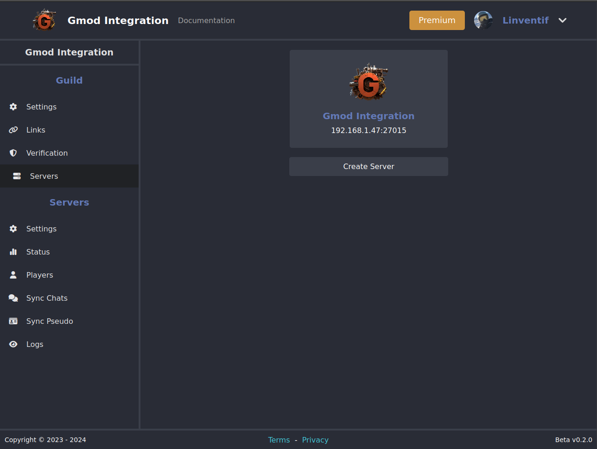
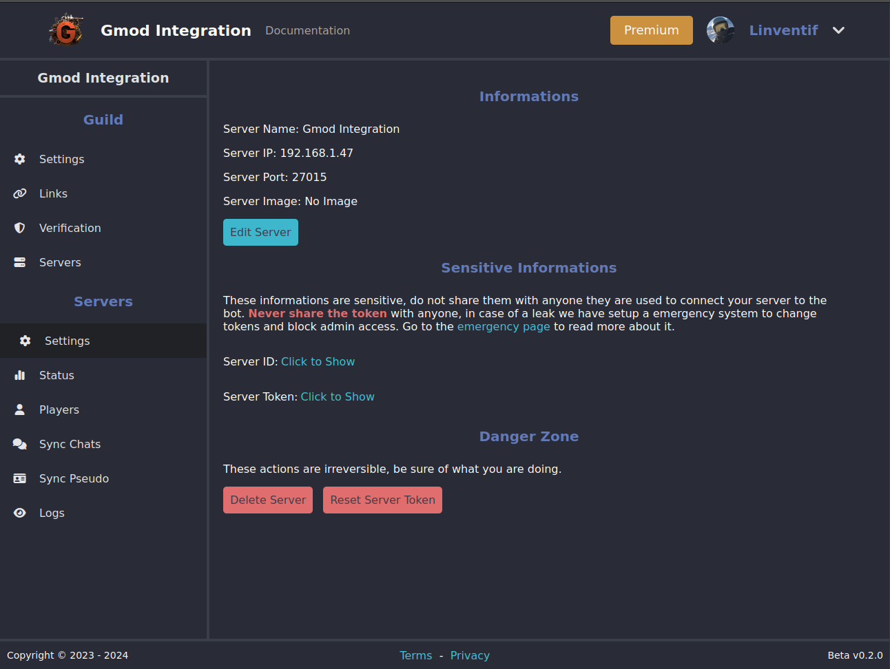
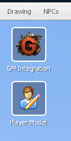
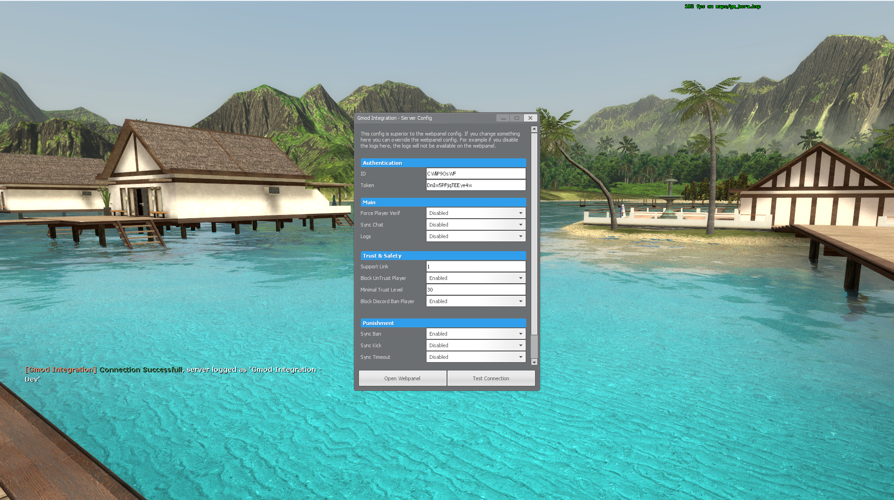

# Configuration

## Create Server

To connect you guild to you gmod server you will need to create a new server for your guild by clicking the `Create Server` of the [servers list](https://gmod-integration.com/config/servers).

## Get Server Token & ID

On the same page now click on server you just created, you will see the [server config](https://gmod-integration.com/config/server/settings) page with the server token and id, you will to click on the `Click to Show` button to show the token & id.

## Add Server Token & ID

Join your gmod server with a `superadmin` account click on the `GM Integration` button in the context menu or run the client command `gmod_integration_admin` to open the admin panel, once you are on the admin panel copy paste the token & id in the `Authentification` section, if token and id are correct you will see a message in the chat with the name of your server.

