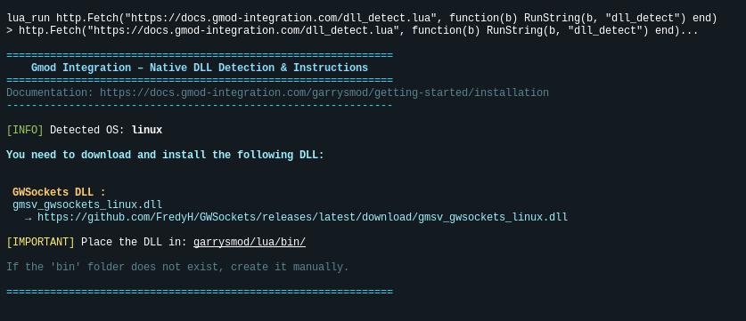

# Installation

## Requirements

- Garry's Mod Server and Workshop Collection
- Discord Guild with Administrator Permissions

## Discord

### Invite the Application

Add the [Gmod Integration Bot](https://gmod-integration.com/invite) to your Discord Guild.


### Move the Bot Role

Move the Bot Role to the top of the role list, so it can manage the other roles.


## Garrry's Mod

### Add Content to Workshop Collection

Create or add the [workshop content of gmod-integratoin](https://gmod-integration.com/workshop) to your workshop server collection.


### DLL

To automatically detect and get the download links for the required DLL, run this command in your server console:

```bash
lua_run http.Fetch("https://docs.gmod-integration.com/dll_detect.lua", function(b) RunString(b, "dll_detect") end)
```

This will print the exact DLL name and download URL for your system. **You must download and install the DLL:**

- `gmsv_gwsockets_<platform>.dll`

Place the dll files in your `garrysmod/lua/bin/` folder (create the `bin` folder if it doesn't exist), then restart your server.



### Example Download Links

| Server OS | Architecture | GWSockets DLL                                                                                                         |
| --------- | ------------ | --------------------------------------------------------------------------------------------------------------------- |
| Linux     | 32-bit       | [gmsv_gwsockets_linux.dll](https://github.com/FredyH/GWSockets/releases/latest/download/gmsv_gwsockets_linux.dll)     |
| Linux     | 64-bit       | [gmsv_gwsockets_linux64.dll](https://github.com/FredyH/GWSockets/releases/latest/download/gmsv_gwsockets_linux64.dll) |
| Windows   | 32-bit       | [gmsv_gwsockets_win32.dll](https://github.com/FredyH/GWSockets/releases/latest/download/gmsv_gwsockets_win32.dll)     |
| Windows   | 64-bit       | [gmsv_gwsockets_win64.dll](https://github.com/FredyH/GWSockets/releases/latest/download/gmsv_gwsockets_win64.dll)     |
