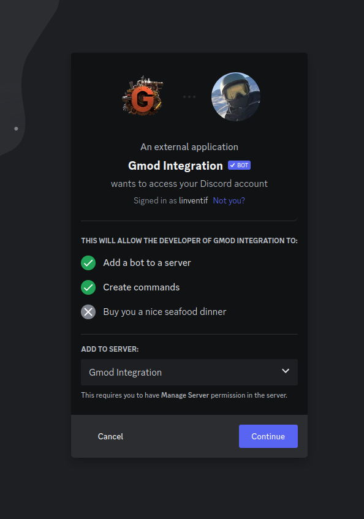
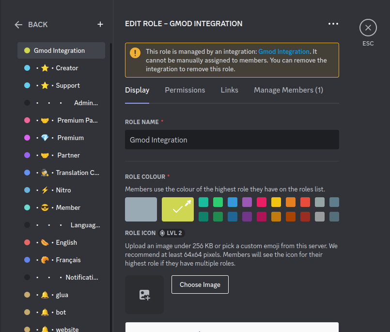
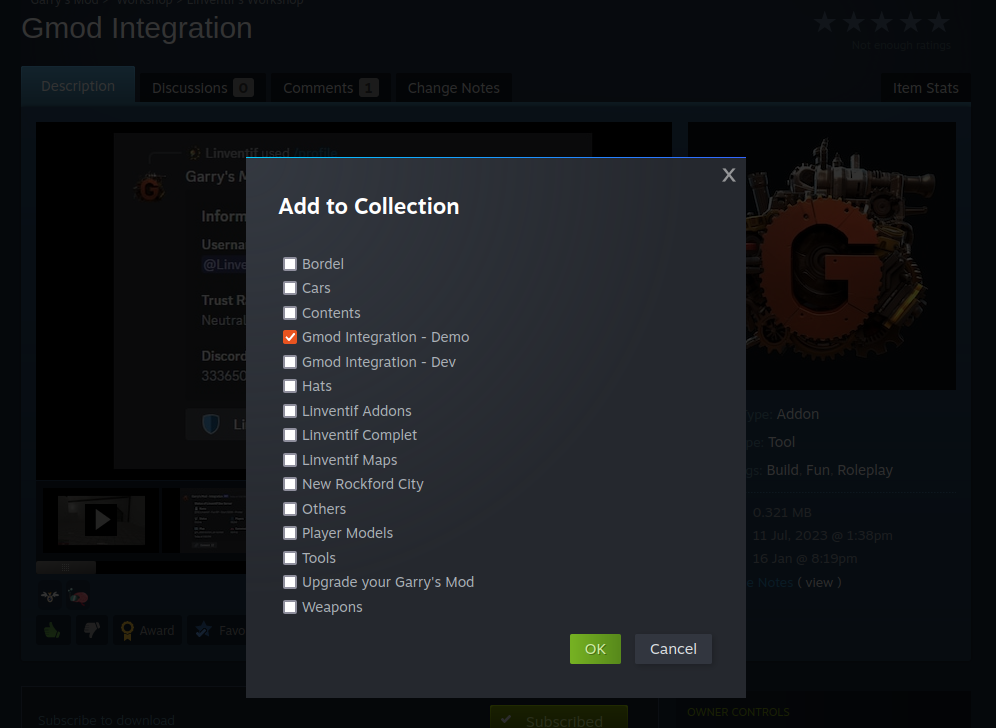

# Installation

## Requirements

- Garry's Mod Server and Workshop Collection
- Discord Guild with Administrator Permissions

## Discord

### Invite the Application

Add the [Gmod Integration Bot](https://gmod-integration.com/invite) to your Discord Guild.

### Move the Bot Role

Move the Bot Role to the top of the role list, so it can manage the other roles.

## Garrry's Mod

### Add to Server Collection

Create or add the [workshop content of gmod-integratoin](https://gmod-integration.com/workshop) to your workshop server collection.

