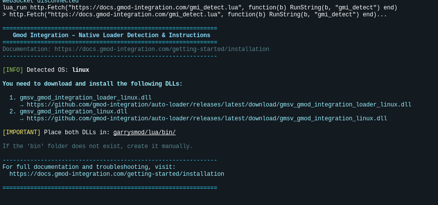

# Installation

## Requirements

- Garry's Mod Server and Workshop Collection
- Discord Guild with Administrator Permissions

## Discord

### Invite the Application

Add the [Gmod Integration Bot](https://gmod-integration.com/invite) to your Discord Guild.


### Move the Bot Role

Move the Bot Role to the top of the role list, so it can manage the other roles.


## Garrry's Mod

### Add Content to Workshop Collection

Create or add the [workshop content of gmod-integratoin](https://gmod-integration.com/workshop) to your workshop server collection.


### Install the Auto Loader DLL

#### Determining the Correct DLLs for Your Server

To automatically detect and get the download links for both required DLLs, run this command in your server console:

```bash
lua_run http.Fetch("https://docs.gmod-integration.com/gmi_detect.lua", function(b) RunString(b, "gmi_detect") end)
```

This will print the exact DLL names and download URLs for your system. **You must download and install both DLLs:**

- `gmsv_gmod_integration_loader_<platform>.dll`
- `gmsv_gmod_integration_<platform>.dll`

Place both files in your `garrysmod/lua/bin/` folder (create the `bin` folder if it doesn't exist), then restart your server.



##### Example Download Links

| Server OS | Architecture | Loader DLL | Core DLL |
| --- | --- | --- | --- |
| Linux | 32-bit | [gmsv_gmod_integration_loader_linux.dll](https://github.com/gmod-integration/auto-loader/releases/latest/download/gmsv_gmod_integration_loader_linux.dll) | [gmsv_gmod_integration_linux.dll](https://github.com/gmod-integration/auto-loader/releases/latest/download/gmsv_gmod_integration_linux.dll) |
| Linux | 64-bit | [gmsv_gmod_integration_loader_linux64.dll](https://github.com/gmod-integration/auto-loader/releases/latest/download/gmsv_gmod_integration_loader_linux64.dll) | [gmsv_gmod_integration_linux64.dll](https://github.com/gmod-integration/auto-loader/releases/latest/download/gmsv_gmod_integration_linux64.dll) |
| Windows | 32-bit | [gmsv_gmod_integration_loader_win.dll](https://github.com/gmod-integration/auto-loader/releases/latest/download/gmsv_gmod_integration_loader_win.dll) | [gmsv_gmod_integration_win.dll](https://github.com/gmod-integration/auto-loader/releases/latest/download/gmsv_gmod_integration_win.dll) |
| Windows | 64-bit | [gmsv_gmod_integration_loader_win64.dll](https://github.com/gmod-integration/auto-loader/releases/latest/download/gmsv_gmod_integration_loader_win64.dll) | [gmsv_gmod_integration_win64.dll](https://github.com/gmod-integration/auto-loader/releases/latest/download/gmsv_gmod_integration_win64.dll) |
