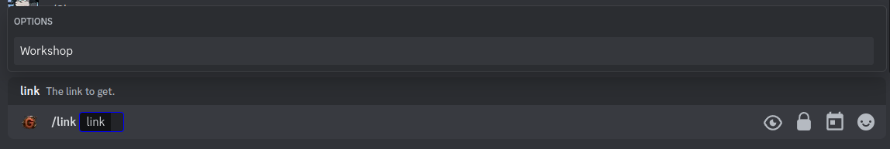
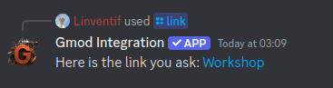
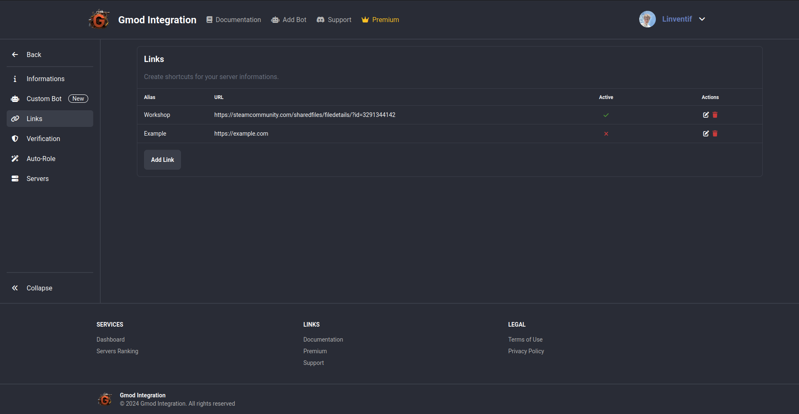
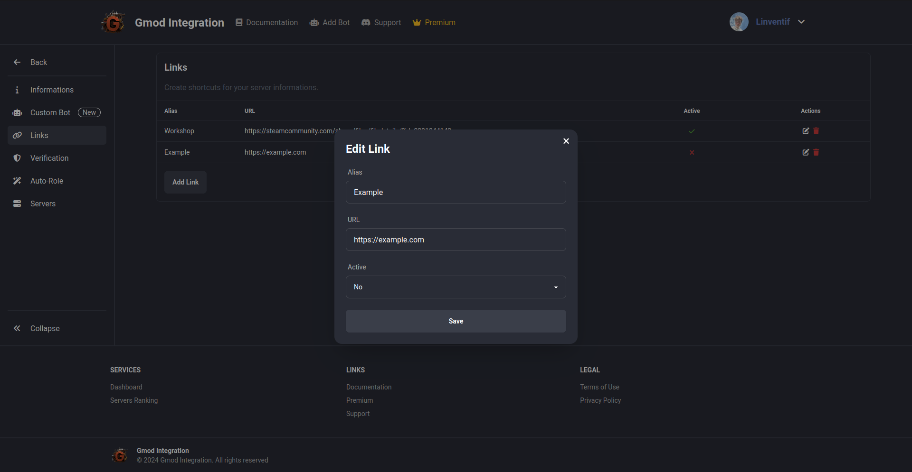

# /links

Guilds Links are like shortcuts to your guilds. If someone askin for the collection of your server, you can just do `/links collection` and the bot will send the collection link.

## Use

To use the links, you can use the `/links` command followed by the alias of the link you want to use.

## Configuration

Links are composed of a `alias`, `url` and `active` field. The `alias` is the command that will be the displayed name of the link, the `url` is the link that will be sent when the command is executed and the `active` field is a boolean that will enable or disable the link.

