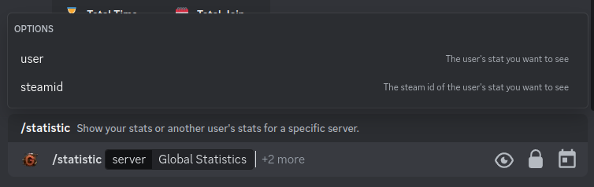
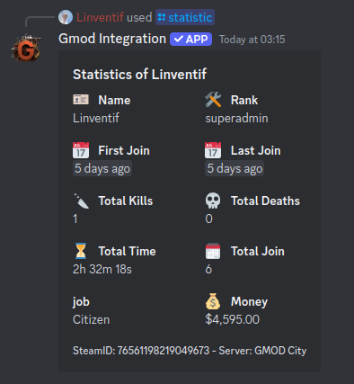
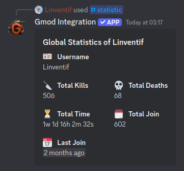

# /statistic

The `/statistic` command is used to display the statistics of the server. The statistics are divided into two categories: `general` and `server`.

## Use

To use the statistics, you can use the `/statistic` command followed by the category of the statistics you want to display.

## Options

- `server`: Display the statistics of the server or the global statistics.
- `user`: Display the statistics of a user.
- `steamid`: Display the statistics of a user by his steamID64.
