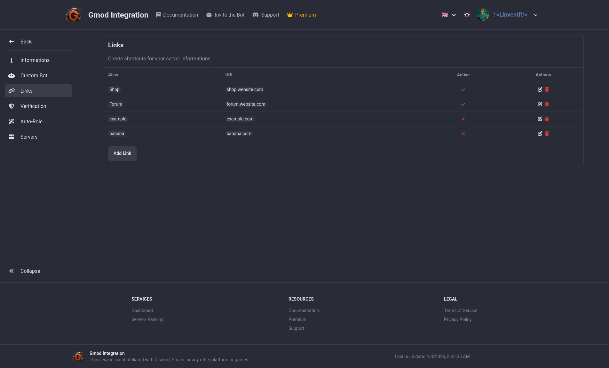

# Links

Links are a quick way to share commonly used URLs with your guild members. You can add links to your website, social media, support server, or any other relevant resources.

Just type /links in your guild's chat to see the list of available links. You can also click on the link name to open it in your browser.

