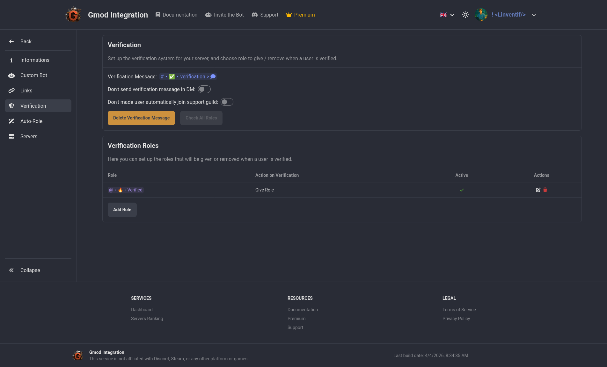

# Verification

In the verification section, you can define action when a user is verified. You can choose to assign a role or remove a role when a user is verified. This can be useful to give access to certain channels or features to verified users only. eg: use auto role to give access to the "unverified" role and then remove it when the user is verified and assign the "verified" role.

You can also set a channel to send a verification message, decide if you want to send verification message in DM if they are not verified on join, and automatically join the official support server when they are verified.

