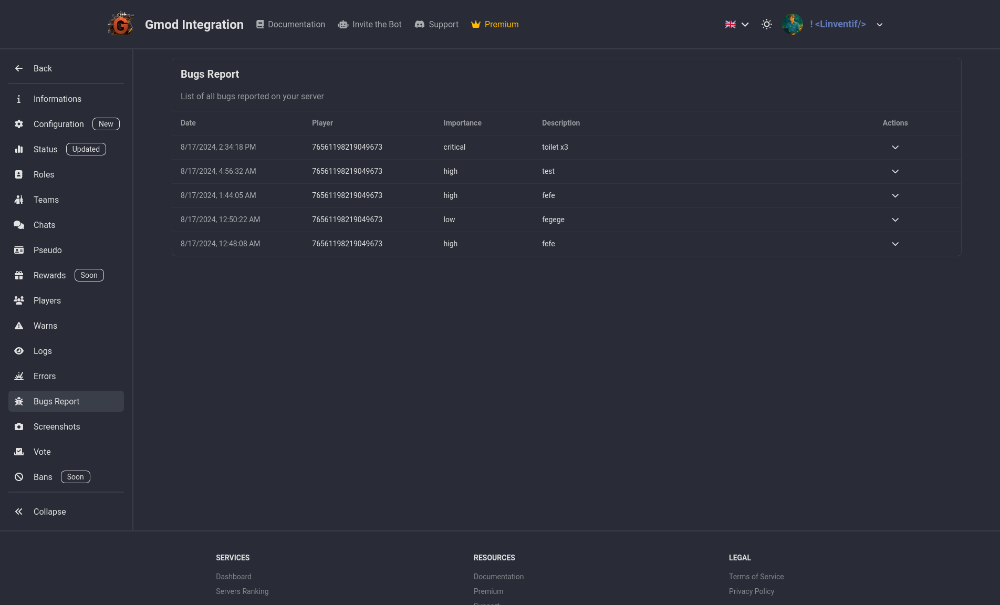

# Bugs Repport

If an users find a bug in the your server and are reporting it to you, it will be listed here. You can see the date, the user who reported it, the importance, what was expected to happen, what actually happened and the steps to reproduce the bug. And a screenshot if the user provided one. All from in game panel, no need to ask for more details, you have everything you need to fix the issue.

