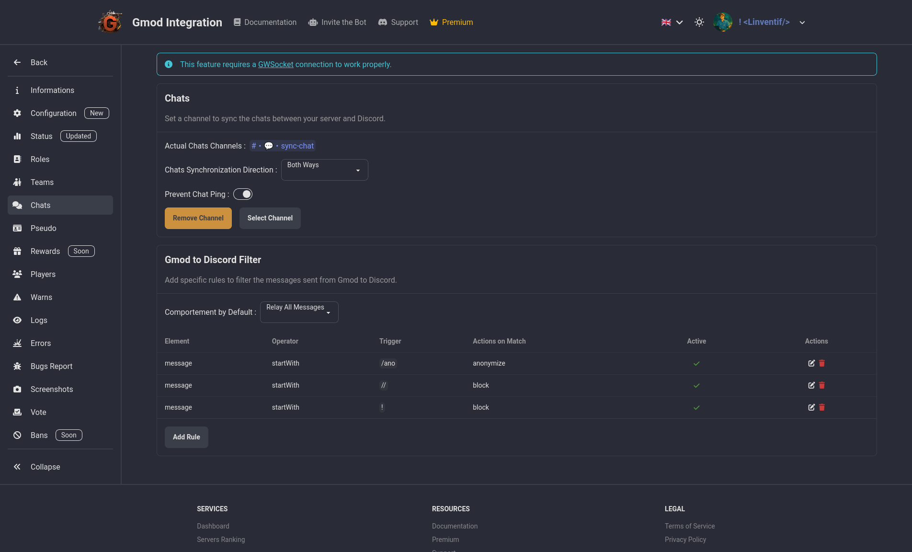

# Chat Relay

Chat relay is a feature that allows you to "relay" the in game chat to a discord channel and message from the discord channel to the in game chat. This is a great way to keep your community engaged and connected even when they are not playing on the server.

You can have custom format for the messages, and also choose to relay only certain types of messages,anonymize the user names, prevent chat pings and more.

