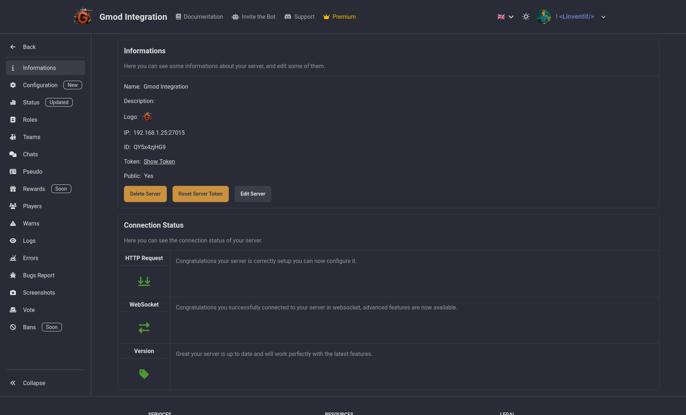

# Informations

See the informations of your server, ID & Token use for auth and connection, if your server is currently connected to the dashboard, and more. And change settings like the server name that will be displayed in the dashboard and in the status message ect.

