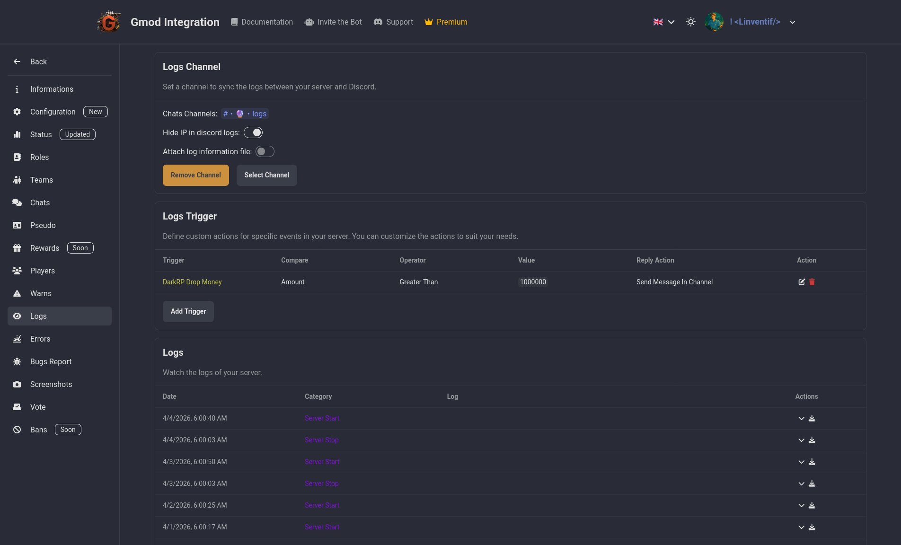

# Logs

See everything that happens in your server. Player kills, deaths, connections, disconnections, chat messages, commands usage, and more.

You can also filter the logs by type and search for specific events. And Relay Logs to a discord channel of your choice, plus set custom setting like adding raw embed with all the details of the event, or just a simple message with the important information and if you want to hide ip addresses for privacy.

You can also add trigger with custom actions to do when a specific event happen. eg: send a message in a discord channel when a player is sending more than $5M to another player to detect potential money duplication ect.

