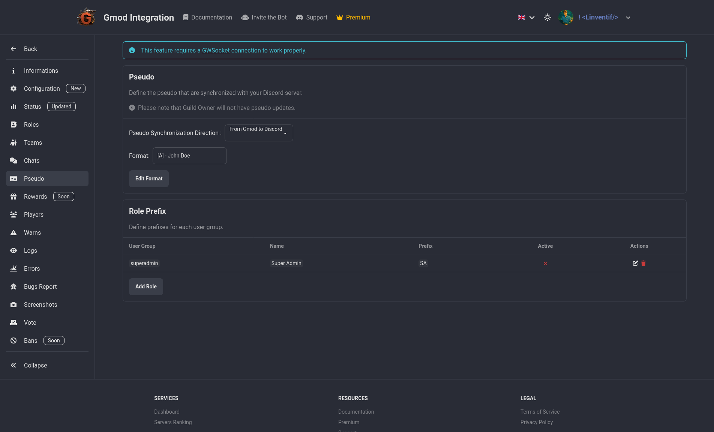

# Pseudo

Sync Pseudo is a tool that allows you to synchronize in game name with your Discord nickname. It is a simple and easy to use tool that can be used to keep your in game name and Discord nickname in sync.

But you can also add a prefix, suffix or custom edit to your in game name. This can be useful if you want to add a clan tag, user group tag or a title to your in game name.

