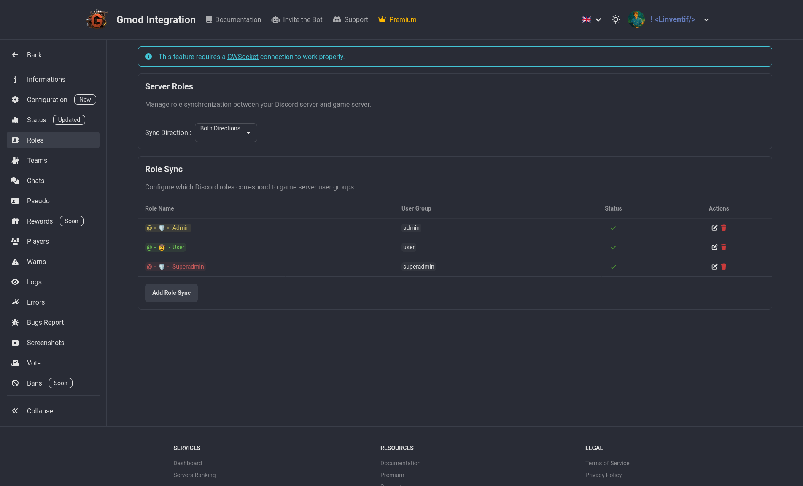

# Sync Roles

This feature allows you to automatically sync the roles of your guild members with their in-game teams. This can be useful to give access to certain channels or features to certain roles only.

Example: admin team can have the "Admin" with moderation access in discord & moderation access in game, and if you demote them from admin team in game, they will lose the "Admin" role in discord and so the moderation access in discord.

