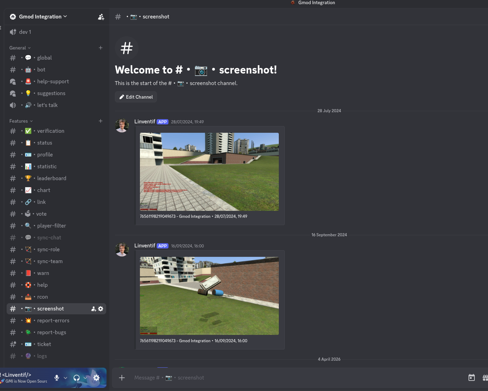
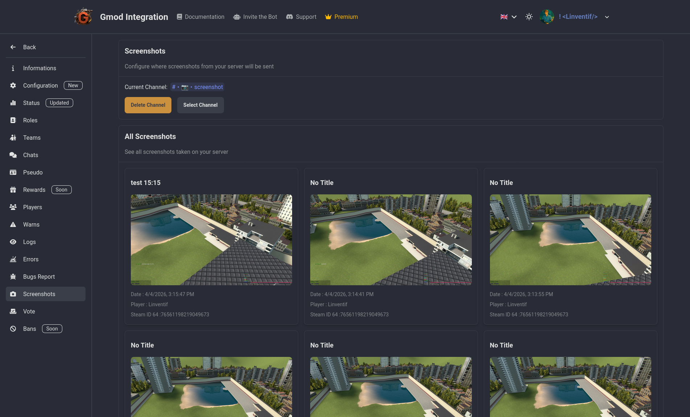

# Screenshots

A super simple way to see all the screenshots taken by your users in game and their metadata. But also a quick way to re-share them on your social media or discord server. You can see the date, the user who took the screenshot and the description they added to it.

