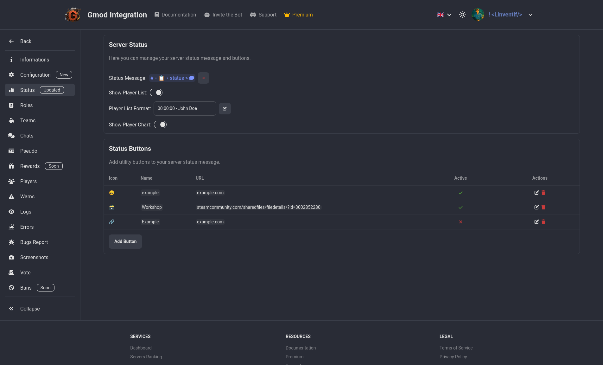
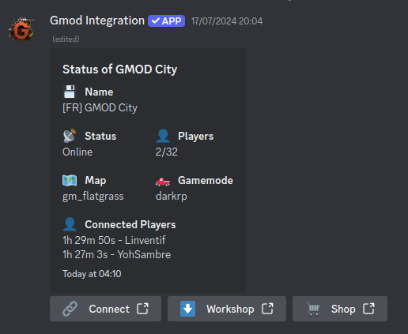

# Status

In the status section, you can send a auto-refreshing message displaying the current status of your server. You can choose to display the number of players, the current map, the uptime, and more. You can also customize the message with placeholders to display the information in a way that suits you best.

You can also add custom buttons under the status message with custom actions. eg: add a button "Workshop" that open the server's workshop collection in the browser, or add a button "Connect" that send the server's ip address in the chat when clicked to make it easier for players to connect to the server.

