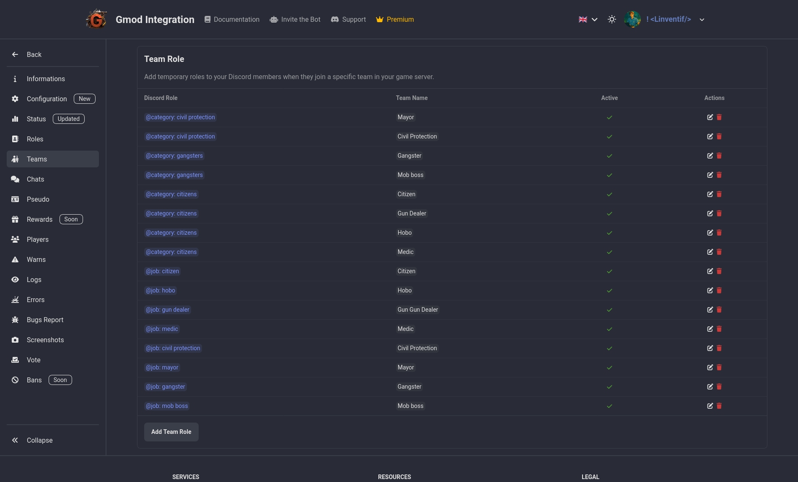

# Team

Assign in game team to a discord role. This can be useful to give access to certain channels or features to certain teams only.

Example: police team can have role "In Duty" and get access to a channel "Police Dispatch" and the "In Duty" role is automatically assigned when they join the police team in game and removed when they leave it.

