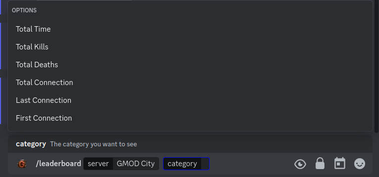
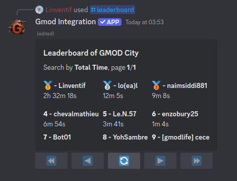

# /leaderboard

The leaderboard is a feature that allows you to see the best players on your server. The leaderboard is based on the statistics of the players.

## Use

To use the leaderboard, you can use the `/leaderboard` command followed by the category of the leaderboard you want to display.

## Options

- `server`: The server you want to send the command to.
- `category`: The category of the leaderboard you want to display.
