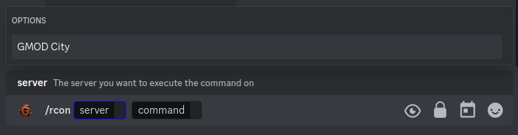
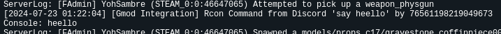

# /rcon

The `/rcon` command is a command that allows you to send RCON commands to your server.

## Use

To use the rcon command, you can use the `/rcon` command followed by the command you want to send to the server.

## Requirements

To use the rcon command, the user must meet the following requirements:

- The user must have he's steamID64 linked to the discord account.
- The user must have the `ADMINISTRATOR` permission on the discord server.
- The user must have the `superadmin` role on the server.

## Options

- `server`: The server you want to send the command to.
- `command`: The command you want to send to the server.
