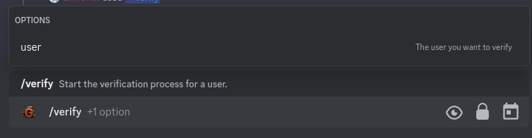

# /verify

The verify command is used to verify a user's identity. This will trigger the verification process configured on the dashboard.

## Use

To use the verify command, you can use the `/verify` command followed by the user mention or the user id.

## Options

- `user`: The user you want to verify.
