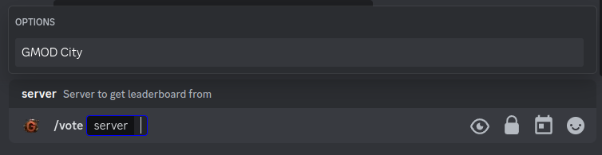

# /vote

Vote are a way to get the members of your server to vote for your server on a website. This can be used to get more members to join your server.

## Use

To use the vote, you can use the `/vote` command followed by the server.

You can vote every 3 hours, and vote are valid for 1month.

## Options

- `server`: The server you want to vote for.
