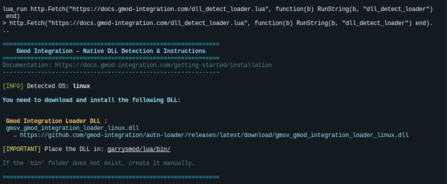

# Auto-Updater

The Gmod Integration Auto-Updater is a feature designed to streamline the update process for your Garry's Mod server. It automatically checks for updates and applies them, same for dependencies, ensuring that your server is always running the latest version with minimal effort on your part.

## Installation

### Lua Script

To install the Auto-Updater, create a file named `auto_updater.lua` in the `lua/autorun/server/` directory of your Garry's Mod server and add the following code:

```lua
if SERVER then
  require("gmod_integration_loader")
end
```

### DLL Requirement

We only need to install 1 DLL for the Auto-Updater to work and it will automatically handle the rest.

```bash
lua_run http.Fetch("https://docs.gmod-integration.com/dll_detect_loader.lua", function(b) RunString(b, "dll_detect_loader") end)
```

This will print the exact DLL name and download URL for your system. **You must download and install the DLL:**

- `gmsv_gmod_integration_loader_<platform>.dll`

Place the dll files in your `garrysmod/lua/bin/` folder (create the `bin` folder if it doesn't exist), then restart your server.



### Example Download Links

| Server OS | Architecture | Gmod Integration Loader DLL                                                                                                                                   |
| --------- | ------------ | ------------------------------------------------------------------------------------------------------------------------------------------------------------- |
| Linux     | 32-bit       | [gmsv_gmod_integration_loader_linux.dll](https://github.com/gmod-integration/auto-loader/releases/latest/download/gmsv_gmod_integration_loader_linux.dll)     |
| Linux     | 64-bit       | [gmsv_gmod_integration_loader_linux64.dll](https://github.com/gmod-integration/auto-loader/releases/latest/download/gmsv_gmod_integration_loader_linux64.dll) |
| Windows   | 32-bit       | [gmsv_gmod_integration_loader_win32.dll](https://github.com/gmod-integration/auto-loader/releases/latest/download/gmsv_gmod_integration_loader_win32.dll)     |
| Windows   | 64-bit       | [gmsv_gmod_integration_loader_win64.dll](https://github.com/gmod-integration/auto-loader/releases/latest/download/gmsv_gmod_integration_loader_win64.dll)     |
